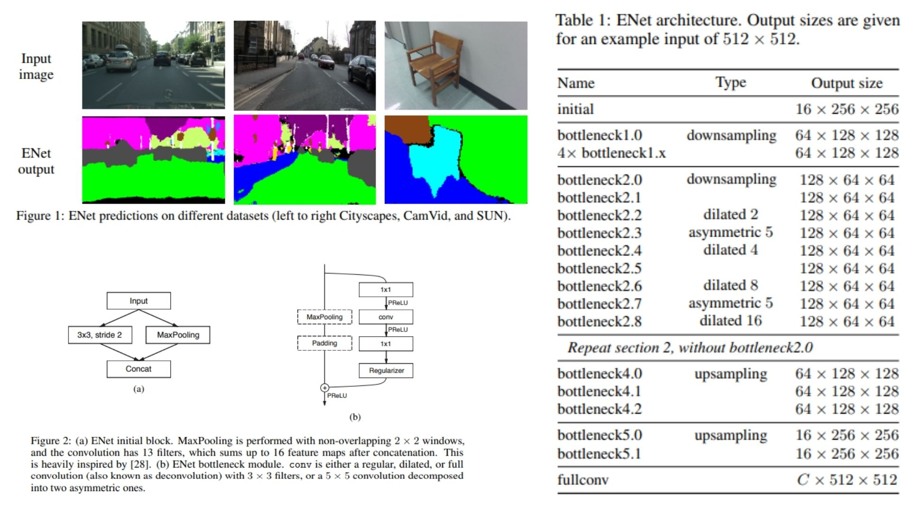

# 💭 ENet-Replication — Efficient Neural Network for Real-Time Semantic Segmentation

This repository provides a **faithful Python replication** of the **ENet architecture**, designed for **real-time semantic segmentation with extreme computational efficiency**. The implementation follows the original paper pipeline, including **early downsampling, bottleneck factorization, asymmetric convolutions, dilated convolutions, and a lightweight decoder design**.

Paper reference: *ENet: A Deep Neural Network Architecture for Real-Time Semantic Segmentation (Paszke et al., 2016)*  https://arxiv.org/abs/1606.02147

---

## Overview 🜂



> ENet is an **encoder–decoder architecture** where the encoder performs aggressive spatial reduction and feature extraction, while the decoder is kept minimal and focuses on reconstructing spatial resolution. The model prioritizes **computational efficiency over redundancy**, making it suitable for real-time applications.

---

## Key Concepts

### Input representation

$$
x \in \mathbb{R}^{H \times W \times 3}
$$

### Early downsampling

The network reduces spatial resolution at the very beginning:

$$
H \times W \rightarrow \frac{H}{2} \times \frac{W}{2} \rightarrow \frac{H}{4} \times \frac{W}{4}
$$

This reduces computational cost significantly while preserving semantic structure.


### Initial block

The initial layer combines convolution and pooling:

- Convolution branch
- Max pooling branch
- Feature concatenation

This can be written as:

$$
f_{out} = [f_{conv}(x), f_{pool}(x)]
$$


### Bottleneck module

The core building block of ENet is the bottleneck:

$$
y = PReLU(BN(W_{expand}(Conv(W_{reduce}(x))))) + x
$$

where:

- $$W_{reduce}$$ reduces channel dimensionality (1×1 conv)
- $$Conv$$ is either:
  - standard convolution
  - dilated convolution
  - asymmetric convolution
- $$W_{expand}$$ restores dimensionality

### Asymmetric convolution

To reduce computation cost:

$$
5 \times 5 \Rightarrow (5 \times 1) + (1 \times 5)
$$

This increases receptive field while maintaining efficiency.

### Dilated convolution

To increase context without downsampling:

$$
y(i) = \sum x(i + r \cdot k)
$$

where $$r$$ is the dilation rate (2, 4, 8, 16).

### Residual learning

Each bottleneck uses skip connections:

$$
y = F(x) + x
$$

This stabilizes training and improves gradient flow.

### Decoder design

Unlike symmetric encoder-decoder models, ENet uses a **lightweight decoder**:

- minimal upsampling blocks
- no heavy feature reconstruction
- focus on refinement instead of computation-heavy decoding

### Final prediction

Pixel-wise classification is performed using a full convolution:

$$
y = \text{Conv}_{1 \times 1}(f_{decoder})
$$

producing:

$$
y \in \mathbb{R}^{C \times H \times W}
$$

---

## Why ENet Matters 🜁

- Optimized for **real-time semantic segmentation**
- Uses **factorized convolutions and bottleneck design**
- Balances **accuracy vs speed efficiently**
- Suitable for **embedded and edge devices**

---

## Repository Structure 🏗️

```
ENet-Replication/
├── src/
│   ├── blocks/
│   │   ├── initial.py     
│   │   ├── bottleneck.py      
│   │   └── layers.py           
│   │
│   ├── encoder/
│   │   └── enet_encoder.py     
│   │
│   ├── decoder/
│   │   └── enet_decoder.py     
│   │
│   ├── model/
│   │   └── enet.py             
│   │
│   ├── head/
│   │   └── fullconv_head.py    
│   │
│   └── config.py               
│
├── images/
│   └── figmix.jpg
│
├── requirements.txt
└── README.md
```

---

## 🔗 Feedback

For questions or feedback, contact:  
[barkin.adiguzel@gmail.com](mailto:barkin.adiguzel@gmail.com)
